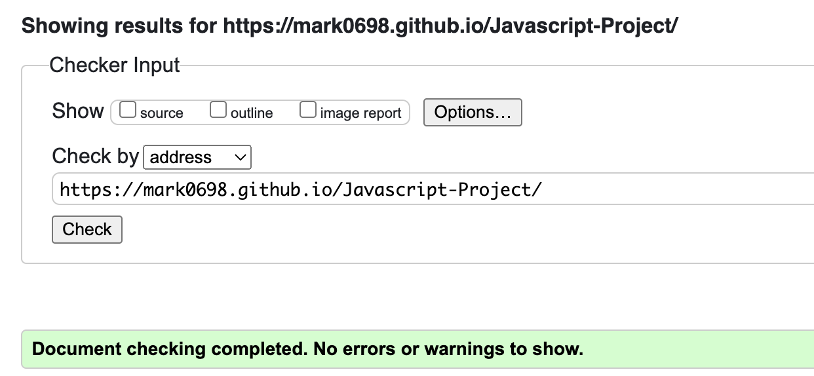

<h1>Read Me File, Project 2<h1>
<h2>Rock Paper Scissors</h2>

This is a user vs computer game of Rock Paper Scissors first to 3, The game utilises loops and functions for its logic.

<h4><u>Content</u></h4>
<li>Features</ul>
<li>Existing features
<li>Features left to implement
<li>Design Choices
<li>Typography</li>
<li>Color scheme</li>
<li>Technology used</li>
<li>Testing</li>
<li>Additional Testing</li>
<li>Known Bugs</li>
<li>Deployment</li>
<li>Credits</li>
<li>Acknowledgments</li>

<h3><u>Features</u></h3>
<h4><u>Existing feautures</u></h4>
<li>Landing page</li>

The index.html page is the only page of the website, it is host to the game and scoreboard.
<li>Notification on load</li>

Upon load, the user is greated with a notification from the browser with regards some of the rules, this can be removed by clicking ok.
<li>Game Section</li>

The game section is host to the controls of the game, these include three buttons signifying rock paper and scissors. The user can choose at random.
<li>Results Section</li>

The results section is where the results of each individual hand of rock paper scissors are displayed, it take the users choice and compares it with a randomly generated number for the computer.
<li>Score Section</li>

The score section keeps track of who has won the games and how many draws there has been, it is first to three and on three the scoreboard resets.

<h3><u>Features left to implement </u></h3>
<h4>Pop Up Rule Screen</h4>

A pop up full sized screen on screen load that runs through rules and explains what the web page is, similair to a terms and conditions page on some websites where by you can not play until a box ticked.

<h3><u>Design Choices</u></h3>
<h4>Typography</h4>
The fonts used throughout the body of the page are font-family: "Raleway", sans-serif; both of which I retrieved from Google fonts.
<h4>Colour Scheme</h4>

These can be seen in the palette below:

<h3><u>Technology Used</u></h3>
<li><a href="https://en.wikipedia.org/wiki/HTML">HTML</a>- provides the content and structure for the website</li>
<li><a href="https://en.wikipedia.org/wiki/CSS">CSS</a>- provides the styling.</li>
<li><a href="https://en.wikipedia.org/wiki/JavaScript">JS</a>- provides the functionality and styling.</li>
<li><a href="https://github.com/">Github</a>- used to host and edit the website.</li>
<li><a href="https://www.gitpod.io/">Gitpod</a>- used to deploy the website</li>

<h3><u>Testing</u></h3>
<h4>Code Validation</h4>

This project has been throughly tested. All the code has been run through the W3C html Validator and the W3C CSS Validator. Minor errors were found on the home and inspiration pages. After a fix and retest, no errors were returned for both.
<h4>HTML test</h4>

