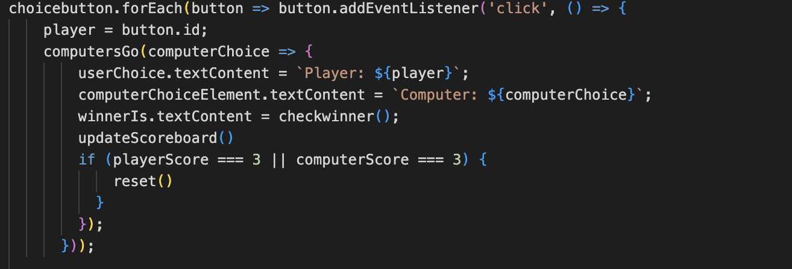

<h1>Read Me File, Project 2<h1>
<h2>Rock Paper Scissors</h2>

This is a user vs computer game of Rock Paper Scissors first to 3, The game utilises loops and functions for its logic.

<h4><u>Content</u></h4>
<li>Features</ul>
<li>Existing features
<li>Features left to implement
<li>Design Choices
<li>Typography</li>
<li>Color scheme</li>
<li>Technology used</li>
<li>Testing</li>
<li>Additional Testing</li>
<li>Known Bugs</li>
<li>Deployment</li>
<li>Credits</li>
<li>Acknowledgments</li>

<h3><u>Features</u></h3>
<h4><u>Existing feautures</u></h4>
<li>Landing page</li>

The index.html page is the only page of the website, it is host to the game and scoreboard.
<li>Notification on load</li>

Upon load, the user is greated with a notification from the browser with regards some of the rules, this can be removed by clicking ok.
<li>Game Section</li>

The game section is host to the controls of the game, these include three buttons signifying rock paper and scissors. The user can choose at random.
<li>Results Section</li>

The results section is where the results of each individual hand of rock paper scissors are displayed, it take the users choice and compares it with a randomly generated number for the computer.
<li>Score Section</li>

The score section keeps track of who has won the games and how many draws there has been, it is first to three and on three the scoreboard resets.

<h3><u>Features left to implement </u></h3>
<h4>Pop Up Rule Screen</h4>

A pop up full sized screen on screen load that runs through rules and explains what the web page is, similair to a terms and conditions page on some websites where by you can not play until a box ticked.

<h3><u>Design Choices</u></h3>
<h4>Typography</h4>
The fonts used throughout the body of the page are font-family: "Raleway", sans-serif; both of which I retrieved from Google fonts.
<h4>Colour Scheme</h4>

These can be seen in the palette below:

<h3><u>Technology Used</u></h3>
<li><a href="https://en.wikipedia.org/wiki/HTML">HTML</a>- provides the content and structure for the website</li>
<li><a href="https://en.wikipedia.org/wiki/CSS">CSS</a>- provides the styling.</li>
<li><a href="https://en.wikipedia.org/wiki/JavaScript">JS</a>- provides the functionality and styling.</li>
<li><a href="https://github.com/">Github</a>- used to host and edit the website.</li>
<li><a href="https://www.gitpod.io/">Gitpod</a>- used to deploy the website</li>

<h3><u>Testing</u></h3>
<h4>Code Validation</h4>

This project has been throughly tested. All the code has been run through the W3C html Validator and the W3C CSS Validator. Minor errors were found on the home and inspiration pages. After a fix and retest, no errors were returned for both.
<h4>HTML test</h4>

<h4>CSS Test</h4>

<h4>Javascript test</h4>

<h3><u>Additional Testing</u></h3>
<h4>Google Lighthouse</h4>

My site was also tested using Google Lighthouse in Chrome Developer Tools to test my webpage for:

<li>Performance - How the page performs whilst loading.</li>
<li>Accessibility - Is the site acccessible for all users and how can it be improved.</li>
<li>Best Practices - Site conforms to industry best practices.</li>
<li>SEO - Search engine optimisation. Is the site optimised for search engine result rankings.</li>

<h4><u>Browser Compatibility</u></h4>

The site was tested on the following browsers with no visible issues for the user. Google Chrome, Microsoft Edge, Safari and Mozilla Firefox.

<h4><u>Known bugs</u></h4>
<li>Computer VS User</li>

 On my intial push of the javascript loop it was returning "you lose" everytime, after much investigation, research and consultation with my mentor, I was able to identify that the code was looking for exact matches in the players choice and the computers choice, however the players choice text had emojis in it which meant it was not an exact match, i was able to recitify this issue by adding ID's to the buttons and looking for matches there instead of within the text displayed on the button.

<h3><u>Deployment</u></h3>
<h4>To deploy the project</h4>

The site was deployed to GitHub pages. The steps to deploy a site are as follows:
<ol>
<li>In the GitHub repository, navigate to the Settings tab.</li>
<li>Once in Settings, navigate to the Pages tab on the left hand side.</li>
<li>Under Source, select the branch to main, then click save.</li>
<li>Once the main branch has been selected, the page will be automatically refresh and the project will be available at the below link </li>
<li>The repository can be found at <a>https://mark0698.github.io/Javascript-Project/</a>

<h4>To create a local clone of the project</h4>
<ol>
<li>Click on the tab titled "code".</li>
<li>In the Clone with HTTPS section, click on the copy and paste button next to the URL</li>
<li>In your IDE of choice, open Git Bash.</li>
<li>Change the directory to the location where you would like the repository</li>
<li>Type git clone, and then paste the URL copied from GitHub.</li>
<li>Press enter and a local copy of the repository will be created</li>
</ol>

<h3><u>Credits</u></h3>
<li>The color palette was created using <a href="https://coolors.co">Coolors</a></li>
<li>The Project was deployed using <a href="https://github.com/">Github</a></li>
<li>The project was written in <a href="https://www.gitpod.io/">Gitpod</a></li>
<li>The emoji icons codes were from <a href="http://unicode.org/emoji/charts/full-emoji-list.html">UniCode</a></li>
<li>Coding and syntax related queries were solved using <a href="https://codeinstitute.net/ie/">Code Institute</a>, <a href="https://www.w3schools.com/">W3schools</a>, <a href="https://www.w3.org/">W3</a> and <a href="https://stackoverflow.com/">Stack overflow</a></li>

<h3><u>Acknowledgements</u></h3>

I would like to thank Aleksei Konovalov my mentor for his help throughout this project with regards brainstorming ideas and and questions I had, as well Aleksei I would like to thank The Code Institue for help on my studies thus far.

